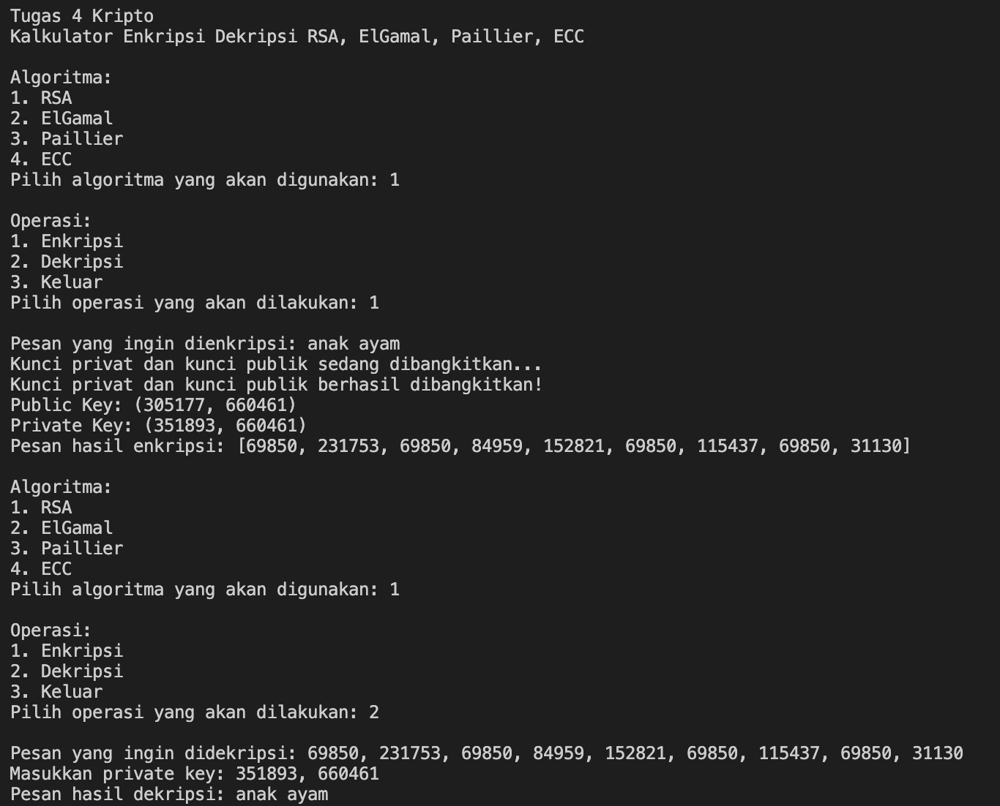
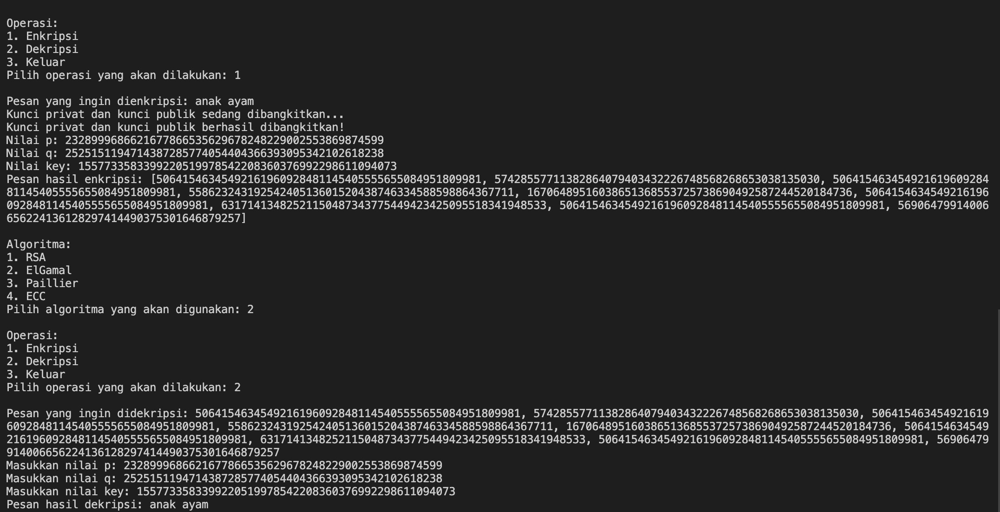
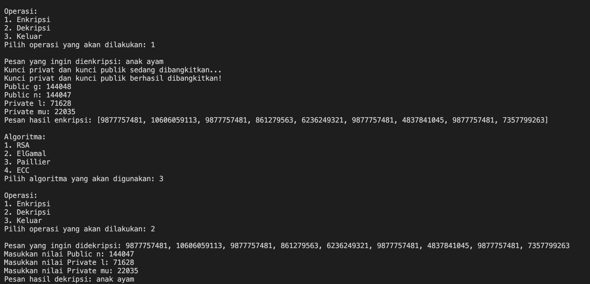

# Tugas 4 Kriptografi

## How To Run
1. Clone this repository
2. Open this repository in your cmd
3. Run 'python main.py'

## Preview
### RSA

## Elgamal

## Paillier

## Oleh
- Fritz Gerald Tjie 13518065
- Byan Sakura 13518066
